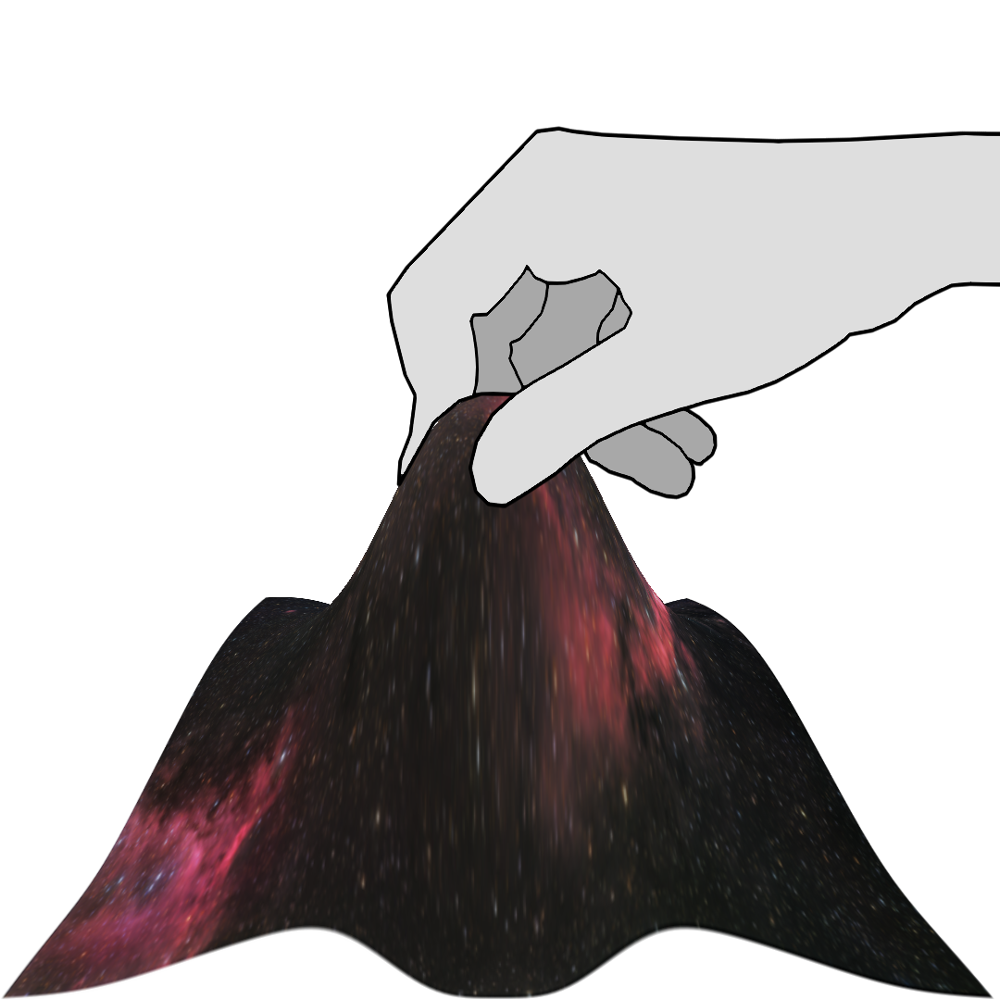
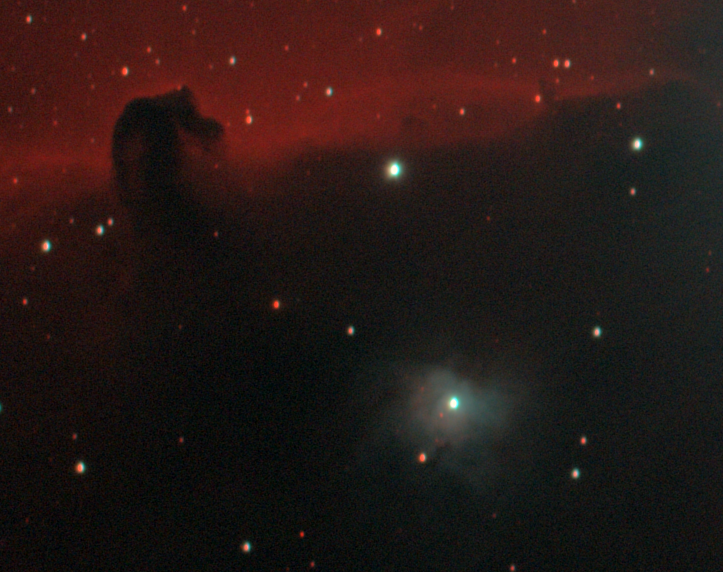
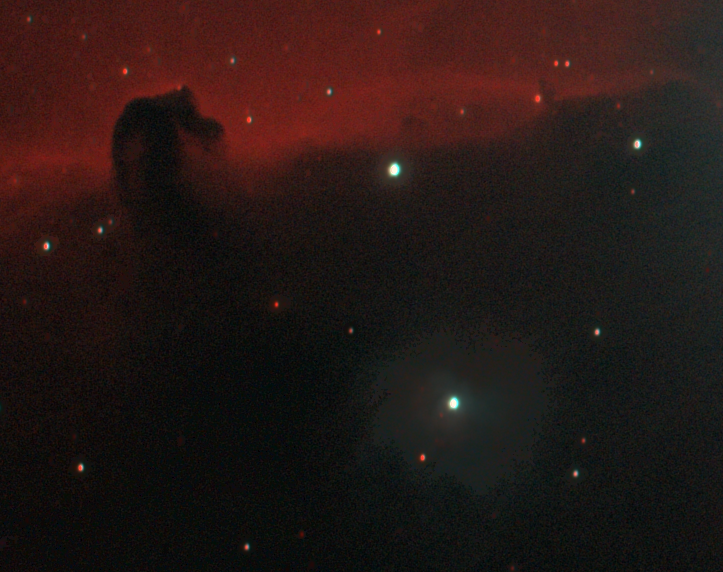
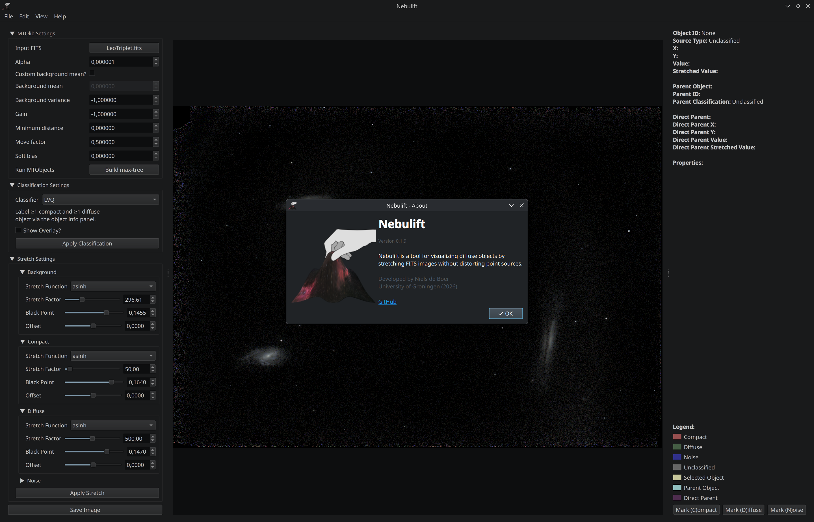

<p align="center">
  
</p>

# Nebulift
Nebulift is an adaptive stretching program for deep-sky astrophotography. It uses
max-tree source detection (MTObjects) to classify sources as compact (stars) or
diffuse (nebulae, galaxies) and applies an independent stretch function to each
class, revealing faint structure without saturating stars, and without
explicit layer separation.


| Global asinh stretch | Nebulift adaptive stretch |
|:---:|:---:|
|  |  |

*For the same region of the Horsehead nebula: a global stretch saturates the star, Nebulift preserves it while revealing the nebula.*

Developed as part of a Bachelor's project in Computing Science at the University of 
Groningen, supervised by Dr M.H.F. Wilkinson and Dr C. Kehl.



*Main window of Nebulift*

## Table of Contents
- [Processing Pipeline](#processing-pipeline)
- [Requirements](#requirements)
- [Installation](#installation)
- [Usage](#usage)
- [Data](#data)
- [License](#license)


## Processing Pipeline
The processing pipeline of Nebulift consists of the following steps:
1. **Data Loading**: load a linear, stacked FITS image.
2. **Max-Tree Source Detection**: MTObjects builds the max-tree and detects significant sources.
3. **Parameter Extraction**: morphological attributes (R_fwhm, A/B, surface brightness, ...) are computed per detected object.
4. **Classification**: sources are classified as compact, diffuse, or noise via thresholds, Gaussian Mixture Models, or Learning Vector Quantization.
5. **Adaptive Stretching**: a class-specific stretch (asinh or linear) is applied directly on the max-tree nodes and the image is reconstructed.


## Requirements
- Python 3.11+ (Was developed on 3.14 and tested on 3.11)
- A C compiler for compiling the MTObjects library (GCC, Clang, etc.)
- Tested on Linux (x86-64 and Raspberry Pi 4/5, aarch64). Windows is untested, but will likely need some modifications.

## Installation
To install Nebulift, follow these steps:
1. Clone the repository:
```bash
git clone https://github.com/TheAefka/nebulift.git
```
2. Install the required dependencies:
```bash
python3 -m venv .venv
source .venv/bin/activate  # On Windows use `.venv\Scripts\activate`
pip install -r requirements.txt
```
3. Compile the MTObjects library:
```bash
cd src && ./recompile.sh && cd .. # Unknown if this works on Windows, might need to modify the script and/or MTOlib.
```

## Usage
To run Nebulift, use the following command:
```bash
python nebulift.py
```
or
```bash
cd src && python main.py
```
This will launch the GUI where you can open a FITS file, pick a classifier, and
adjust the per-class stretch parameters. Refer to the thesis for more details.


## Data
The test images of M81/M82, Leo Triplet, M45, and the Horsehead
nebula are (c) M. H. F. Wilkinson and released under
[CC BY 4.0](https://creativecommons.org/licenses/by/4.0/), included with
permission


## License
The Nebulift source code (excluding the `mtolib` directory and the data) is
licensed under the MIT License. See the [LICENSE](LICENSE) file for details.

Please do note that the MTObjects library (`src/mtolib`) does not have a license,
so use it at your own risk.